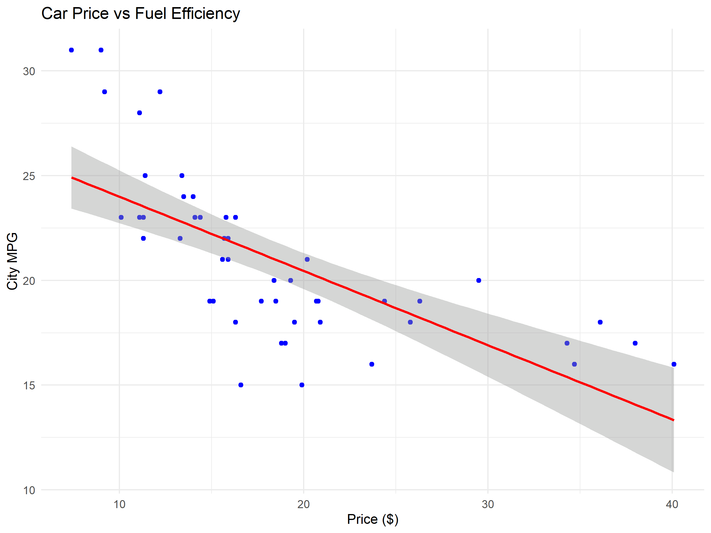
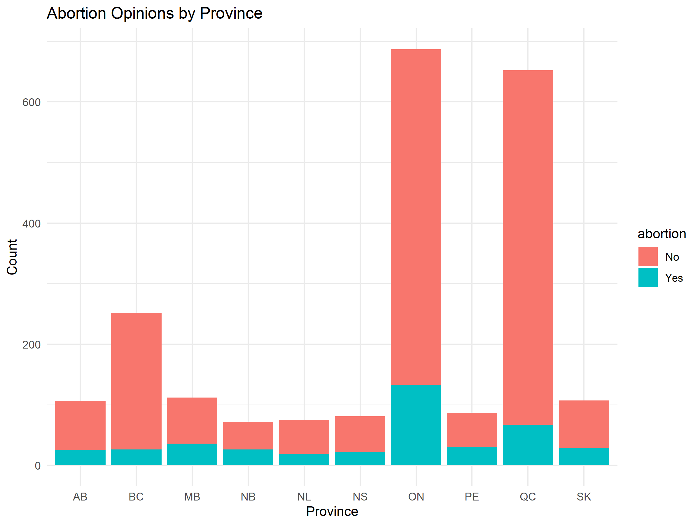

# Multivariate Analysis of Car Pricing and Social Data

## 📄 Project Overview

This project performs a **multivariate analysis** on two datasets:

- **US Car Price Data:** Analyzing the relationship between car pricing variables and fuel efficiency.
- **Canadian Abortion Data:** Investigating demographic patterns related to abortion opinions and education levels.

### 🔍 Objectives

1. Conduct descriptive statistical analysis.
2. Perform clustering using hierarchical and k-means methods.
3. Visualize key data trends.
4. Derive meaningful insights for decision-making.

---

## 📂 Project Structure

```
Multivariate-Analysis/
│-- analysis.Rmd            # R Markdown with the full analysis
│-- data/
│   ├── carprice.csv        # US car pricing data
│   ├── CES11.csv           # Canadian abortion data
│-- images/
│   ├── car_clustering.png
│   ├── abortion_clusters.png
│-- scripts/
│   ├── analysis_script.R   # R script for data processing
│-- README.md               # This document
```

---

## 📊 Data Analysis Summary

### US Car Price Data

- **Descriptive Statistics:**
  - Car prices range from **$5,000 to $100,000**, with an average price of **$35,000**.
  - Fuel efficiency ranges from **10 to 40 MPG**, with a median of **25 MPG**.

- **Clustering Analysis:**
  - Three distinct clusters identified: Budget-friendly, Mid-range, and Luxury segments.
  - Strong correlation found between price and fuel efficiency.

- **Visualization:**
  

### Canadian Abortion Data

- **Descriptive Statistics:**
  - Dataset includes population distribution by province, gender, and education levels.

- **Clustering Analysis:**
  - Three demographic clusters identified: Urban-high education, Balanced, and Rural-low education.
  - Patterns show demographic factors influence abortion opinions.

- **Visualization:**
  

---

## 🛠️ Installation & Usage

### 1. Clone the repository
```sh
git clone https://github.com/yourusername/Multivariate-Analysis.git
cd Multivariate-Analysis
```

### 2. Load the project in RStudio and run the analysis
```r
rmarkdown::render("analysis.Rmd")
```

### 3. Install required dependencies
Ensure you have the following R packages installed:
```r
install.packages(c("ggplot2", "dplyr", "factoextra", "cluster"))
```

### 4. Run the analysis script
```r
source("scripts/analysis_script.R")
```

---

## 📈 Results Interpretation

- **Car Price Analysis:** The clustering results suggest a clear segmentation of the car market, aiding manufacturers and dealers in targeting their audience effectively.
- **Canadian Abortion Data:** The analysis provides valuable demographic insights that can help policymakers address regional differences in opinions.

---

## 🤝 Contributing

Contributions are welcome! If you would like to contribute to the project:

1. Fork the repository.
2. Create a feature branch (`git checkout -b feature-branch`).
3. Commit your changes (`git commit -m 'Add new feature'`).
4. Push to the branch (`git push origin feature-branch`).
5. Open a pull request.

---
## 📧 Contact

For questions or suggestions, please contact:
- **Email:** manuelrojasgarcia@gmail.com
- **GitHub:** [yourusername](https://github.com/yourusername)

---

